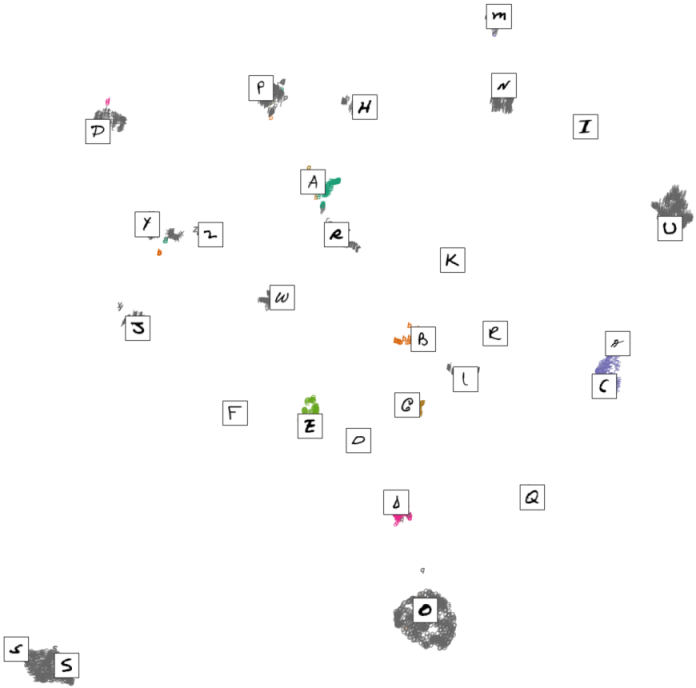
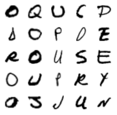
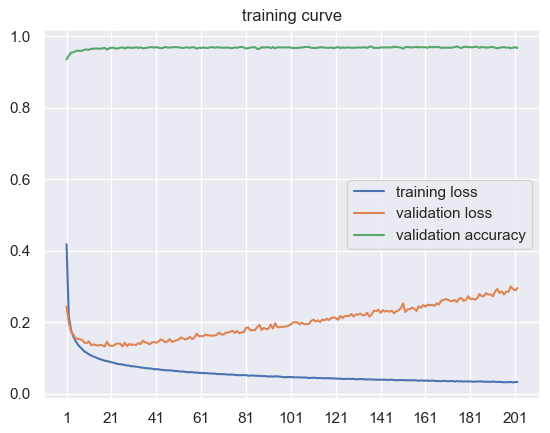
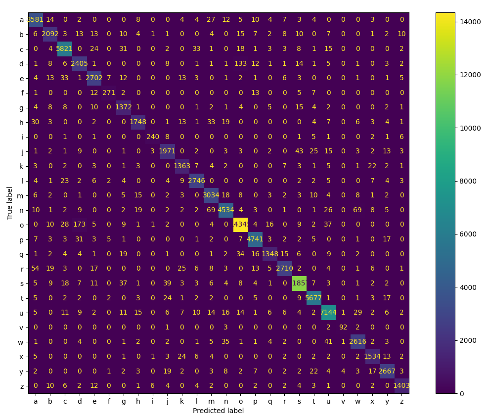

# Recognize Handwritten Letters

## Description

The goal of this project is to recognize handwritten letters.

## Dataset

We are working on a [MNIST-like dataset for letters](https://www.kaggle.com/datasets/ashishguptajiit/handwritten-az/data).

  

Above are shown the 25 first letters of the dataset.

## Gallery

### Learning curves & correlation matrix with a CNN network

Our CNN achieved more than 98% of accuracy on the test set.

  
   

### Embedding of the letters with UMAP

Here we reduced the dimension of the dataset from 784 dimensions to 2, with the UMAP algorithm.

